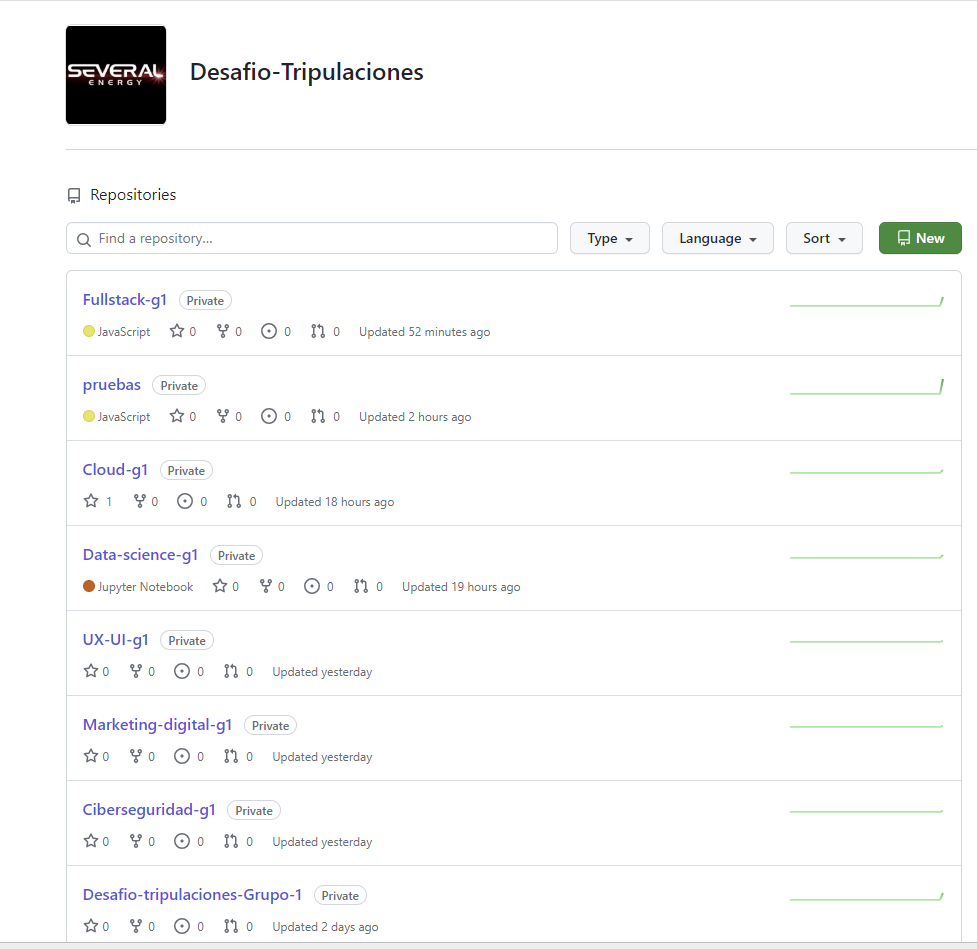
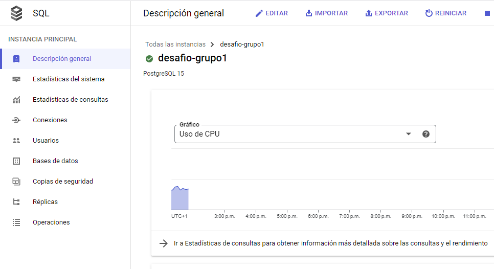

# CLOUD-G1. DESAFÍO DE TRIPULACIONES. THE BRIDGE

## Descripción del Proyecto

Este proyecto tiene como objetivo proporcionar una infraestructura eficiente en la nube utilizando Google Cloud Platform (GCP). Nuestro equipo se centrará en implementar un sistema completo que incluye un frontend y un backend, ambos desplegados de forma independiente en Cloud Run, y una base de datos PostgreSQL gestionada por GCP SQL.

## Servicios Utilizados

### 1. Frontend y Backend en Cloud Run

Tanto el frontend como el backend de nuestra aplicación se implementarán utilizando Google Cloud Run, un servicio que permite ejecutar contenedores de manera eficiente y sin preocuparse por la infraestructura subyacente. Cloud Run escala automáticamente según la demanda, garantizando un rendimiento óptimo y una gestión eficiente de los recursos.

### 2. CI/CD con Cloud Build

La integración continua (CI) y la implementación continua (CD) se llevarán a cabo mediante Cloud Build. Este servicio se configurará para ejecutarse automáticamente cuando se realicen cambios en el repositorio de GitHub asociado al proyecto. Cloud Build se encargará de compilar, probar y desplegar automáticamente tanto el frontend como el backend en Cloud Run.

### 3. Base de Datos PostgreSQL en GCP SQL

La gestión de datos estará a cargo de una base de datos PostgreSQL gestionada por Google Cloud SQL. Este servicio proporciona una base de datos relacional altamente disponible y completamente administrada, lo que garantiza la seguridad y la escalabilidad mientras nos permite centrarnos en el desarrollo de la aplicación en lugar de la gestión de la base de datos.

### 4. Aplicación para Webscraping en Cloud Run

## Pasos a seguir:

### Paso 1.

En el inicio del Desafío, se llevará a cabo la creación de una organización en GitHub, la cual albergará un repositorio principal con submódulos designados para cada una de las verticales. Este enfoque estratégico nos permitirá consolidar el trabajo de todas las verticales en un único repositorio principal, proporcionando un espacio centralizado para la colaboración. Cada vertical trabajará de forma independiente en sus respectivos repositorios (submódulos), permitiendo un desarrollo ágil y modularizado.

Como parte de la planificación inicial, hemos definido cuidadosamente los permisos asignados a los miembros de la organización en relación con el repositorio principal y sus submódulos correspondientes. Esta estructura de permisos está diseñada para garantizar un equilibrio entre la colaboración eficiente y la seguridad del proyecto. Cada integrante de la organización tendrá acceso específico y bien definido, de acuerdo con su función y responsabilidad en el desarrollo del proyecto.

La decisión de implementar esta organización y estructura de repositorio se basa en la necesidad de facilitar la coordinación y gestión del proyecto. Al centralizar el trabajo en el repositorio principal, se promueve una visión holística del progreso y se optimiza la administración de las diferentes verticales. Al mismo tiempo, la independencia de cada vertical en sus propios submódulos permite una flexibilidad óptima para el desarrollo paralelo y la escalabilidad del proyecto.

Este enfoque organizativo, respaldado por una cuidadosa asignación de permisos, sienta las bases para un trabajo eficiente y colaborativo, asegurando que cada miembro de la organización pueda contribuir de manera efectiva a su vertical específica, al tiempo que mantiene la cohesión del proyecto en su conjunto.

En paralelo, una vez que hemos seleccionado la plataforma en la nube para llevar a cabo nuestro trabajo, específicamente Google Cloud, hemos dado un paso crucial hacia la configuración efectiva de nuestro entorno de desarrollo. En este contexto, hemos establecido un proyecto dedicado exclusivamente para el Desafío. Esta acción no solo facilita la gestión y la organización de los recursos asociados con el proyecto, sino que también establece un marco de trabajo claro y estructurado para todas las etapas de desarrollo.

Además, como parte de una práctica prudente de gestión financiera, hemos implementado una alerta de presupuesto dentro de la plataforma. Esta alerta está diseñada para supervisar de cerca los gastos que se puedan generar durante el desarrollo del proyecto. La creación de esta alerta de presupuesto no solo refleja nuestro compromiso con la transparencia y la responsabilidad en el uso de recursos, sino que también nos proporciona un mecanismo proactivo para controlar y ajustar nuestras actividades en función de las consideraciones financieras.

Este enfoque estratégico hacia la administración del presupuesto no solo busca evitar sorpresas inesperadas en términos de costos, sino que también contribuye a una toma de decisiones informada y eficiente. La implementación de esta alerta de presupuesto demuestra nuestro compromiso con la optimización de recursos, asegurando que cada gasto esté alineado con los objetivos y las metas del proyecto.

En resumen, la selección de Google Cloud como plataforma, la creación del proyecto dedicado y la implementación de una alerta de presupuesto forman parte integral de nuestra estrategia para asegurar un desarrollo fluido y eficiente, combinando tecnología avanzada con una gestión financiera rigurosa.

### Paso 2.

En el paso 2, hemos dado un paso significativo al recibir una aplicación inicial de Fullstack, diseñada para realizar pruebas y ser implementada en Google Cloud Platform (GCP). Esta aplicación simplificada proporciona la base sobre la cual realizaremos evaluaciones exhaustivas, permitiéndonos identificar los requisitos esenciales y las áreas de mejora a medida que Fullstack continúe aportando actualizaciones y mejoras a la aplicación web.

En respuesta a esta entrega, hemos establecido un repositorio de pruebas dedicado. Aquí, hemos llevado a cabo el proceso de Dockerización de la aplicación recibida, creando una imagen que encapsula de manera eficiente todos los componentes necesarios para su ejecución. Esta imagen sirve como base sólida para la automatización del despliegue mediante la implementación de Cloud Build.

En particular, hemos configurado un flujo de trabajo en Cloud Build que orquesta la creación de una instancia en **Cloud Run**, permitiéndonos levantar la aplicación de manera eficiente y escalable. Este proceso se activa automáticamente mediante un trigger vinculado a la rama del proyecto en la cual Fullstack realiza sus desarrollos y actualizaciones(DEV). De esta manera, garantizamos una integración continua y un despliegue consistente del frontend y el backend de la aplicación cada vez que se actualiza dicha  rama.

Este enfoque de automatización no solo agiliza el proceso de despliegue, sino que también establece una base robusta para la gestión eficiente de actualizaciones y mejoras en la aplicación. Al vincular estrechamente el despliegue a las actualizaciones en el código fuente, aseguramos una sincronización precisa entre el desarrollo de Fullstack y la implementación en la infraestructura de GCP.

En resumen, el paso 2 está marcado por la preparación meticulosa de la aplicación para la implementación en GCP, destacando la importancia de la automatización y la integración continua en nuestro enfoque de desarrollo. Este proceso nos posiciona para una gestión eficiente y ágil a medida que avanzamos en el desarrollo y mejora de la aplicación web.

 

En paralelo, hemos dotado al equipo de Data con una infraestructura de base de datos altamente eficiente al proporcionar una instancia de **Cloud SQL para PostgreSQL 15**, un recurso completamente administrado en Google Cloud Platform (GCP). Esta elección refuerza nuestra estrategia al proporcionar una solución escalable y segura para las necesidades de base de datos del proyecto.

Adicionalmente, hemos optado por utilizar **pgAdmin**, una herramienta integral que facilita el acceso y la administración de esta instancia. Para ello, hemos asignado una IP pública y proporcionado credenciales de usuario y contraseña al equipo de Data. **pgAdmin** permitirá realizar tareas cruciales como la creación y el diseño de contenido en la base de datos de manera eficiente.

La elección de **pgAdmin** como herramienta principal para la gestión de la base de datos se alinea con las mejores prácticas y estándares de la industria. Esta interfaz gráfica de usuario simplifica las operaciones complejas, permitiendo al equipo de Data visualizar y gestionar eficientemente la estructura y el contenido de la base de datos **Cloud SQL para PostgreSQL 15**. Además, facilita la colaboración y el trabajo en equipo al proporcionar una interfaz intuitiva y funcionalidades avanzadas para la administración de bases de datos.

Este enfoque integral en la infraestructura de datos no solo demuestra nuestro compromiso con la eficiencia y la accesibilidad, sino que también sienta las bases para una gestión de datos efectiva a lo largo de todas las fases del proyecto. La combinación de la robustez de **Cloud SQL para PostgreSQL 15** y la intuitividad de **pgAdmin** ofrece al equipo de Data un entorno propicio para la creación, diseño y gestión de una base de datos relacional sólida.

En resumen, la provisión de una instancia **Cloud SQL para PostgreSQL 15** junto con la implementación de **pgAdmin** establece una base sólida para la gestión de datos en el proyecto, brindando al equipo de Data las herramientas necesarias para realizar su trabajo de manera efectiva y colaborativa.

En una iniciativa paralela, hemos avanzado en la asignación de permisos específicos al grupo de Ciberseguridad para otorgarles acceso de lectura a la infraestructura en la nube. Este paso estratégico facilita la capacidad del equipo de Ciberseguridad para llevar a cabo evaluaciones exhaustivas, identificando y analizando posibles riesgos asociados a los servicios creados.

La concesión de permisos de lectura proporciona al equipo de Ciberseguridad una visión integral de la configuración y el funcionamiento de los servicios en la nube. Este acceso permite la revisión detallada de la arquitectura, la identificación de posibles puntos de vulnerabilidad y la realización de evaluaciones de riesgos de manera proactiva.

Esta medida no solo refleja nuestro compromiso con la seguridad del proyecto, sino que también establece una colaboración efectiva entre los equipos técnicos y de seguridad. Al permitir que el equipo de Ciberseguridad realice evaluaciones desde las fases iniciales del desarrollo, garantizamos la identificación temprana de posibles riesgos, lo que facilita la implementación de medidas preventivas y correctivas de manera oportuna.

Además, este enfoque proactivo hacia la seguridad refuerza la solidez y la confiabilidad de la infraestructura en la nube. La cooperación entre los equipos técnicos y de Ciberseguridad crea un marco integral que aborda la seguridad como un aspecto crítico y continuo del desarrollo del proyecto.

En resumen, la concesión de permisos de lectura al grupo de Ciberseguridad demuestra nuestro compromiso con la seguridad desde el inicio del proyecto, permitiendo evaluaciones proactivas y fortaleciendo la robustez de la infraestructura en la nube creada. Este enfoque estratégico asegura que la seguridad sea una consideración central en todas las etapas del desarrollo y la implementación.
